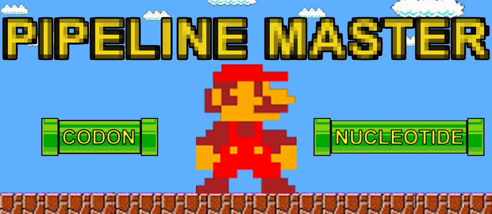

# Introduction
This project is a road map that demonstrates how to use common workflow tools ([Luigi](https://luigi.readthedocs.io/en/latest/index.html), [NextFlow](https://www.nextflow.io/docs/latest/index.html), [Snakemake](https://snakemake.readthedocs.io/en/stable/) and [Slurm-Pipeline](https://github.com/acorg/slurm-pipeline)) to build a data pipline.

What's special about this project is the architecture. Namely, abstracting pipes into an individual microservices, and orchestrating it with a master microservice.

## Requirements
In order to run the project below stack has to be installed.
* [git](https://git-scm.com/downloads)
* [docker](https://docs.docker.com/engine/installation/)
* [docker-composer](https://docs.docker.com/compose/install/)

# Architecture


- **Pipline Master** - an orchestrator that binds all pipes.
- **Codon Pipe** - a pipe that has `cdncounter` program that counts codons in a *".fsa"* file.
- **Nucleotide Pipe** - a pipe that has `ntcounter` program that counts nucleotides in a *".fsa"* file.

# Implementation of the architecture
We abstract each element of the architecture to a single microservice using docker. This way we containerize our architectures which translates to below maping.

- **Pipline Master** == **Pipline** container
- **Codon Pipe** == **Codon** container
- **Nucleotide Pipe** == **Nucleotide** container

We connect all containers with the `docekr-compose.yml` file.

# Installation

## Cloning the project
```bash
$ cd ~
$ git clone --recursive https://github.com/ldynia/pipeline.git
$ cd pipeline
```

## Build images / Start up containers.
```Bash
$ docker-compose up -d
```

## Investigate running containers
```Bash
$ docker ps
CONTAINER ID        IMAGE                   COMMAND                  CREATED             STATUS              PORTS                                                                                  NAMES
6edf957143ec        ldynia/pipeline:1.0     "/docker/startup.s..."   5 seconds ago       Up 3 seconds        22/tcp                                                                                 pipeline
5b8e8b4f3312        ldynia/codon:1.0        "sh /docker/startu..."   5 seconds ago       Up 4 seconds                                                                                               codon
5c09a1969e1d        ldynia/nucleotide:1.0   "sh /docker/startu..."   5 seconds ago       Up 4 seconds                                                                                               nucleotide
```

## Hook into master container
```Bash
$ docker exec -it pipeline bash
```

# Workflow Managers
To run any of below workflows managers execute approiated to workflow command. Output of a command will be found in `/pipline/results/` path. **Note:** Remember to remove output files after running each command.

## Luigi

* [docs](https://luigi.readthedocs.io/en/latest/index.html)
* [github](https://github.com/spotify/luigi)

```bash
$ cd /app/luigi
$ PYTHONPATH='.' luigi --module tasks.run_all RunAllTask --local-scheduler
```

## NextFlow

* [docs](https://www.nextflow.io/docs/latest/index.html)
* [github](https://github.com/nextflow-io/nextflow)

```bash
$ cd /app/next_flow
$ nextflow pipeline.nf
```

## Snakemake

* [docs](https://snakemake.readthedocs.io/en/stable/)
* [bitbucket](https://bitbucket.org/snakemake/snakemake/src)

```bash
$ cd /app/snakemake
$ snakemake $(snakemake -l)
```

## Slurm

* [github](https://github.com/acorg/slurm-pipeline)

```bash
$ cd /app/slurm-pipeline
$ slurm-pipeline.py -s pipeline.json > status.json
```
